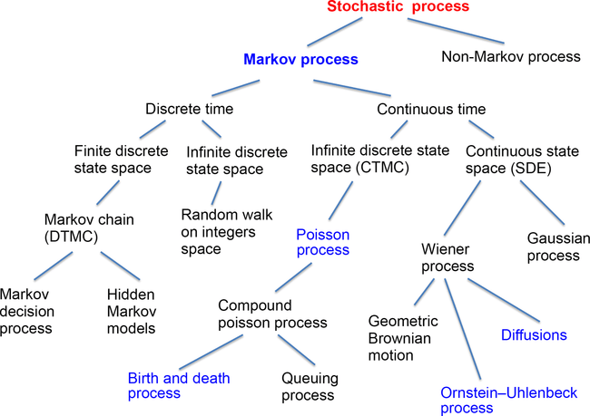

<!--  -->

  

---

# Applied Stochastic Processes - Course Assignments

This repository contains my assignments completed for the course *18751: Applied Stochastic Processes* during Fall 2024 at Carnegie Mellon University. The repo showcases hands-on applications of probability theory and stochastic systems as covered in the course syllabus.

## Repository Purpose

The assignments here reflect my work on solving complex problems related to probability, random variables, stochastic processes, and signal processing. Each assignment aligns with the topics listed below and demonstrates practical applications of the theoretical concepts taught in the course.

## Course Overview

*18751: Applied Stochastic Processes* provides a deep dive into probability theory and its applications in stochastic systems. The course equips students with the tools to analyze and model randomness in engineering and scientific contexts. Below is a summary of the key topics covered:

### Topics Covered
- **Probability and Random Variables**: Foundations of probability, discrete and continuous random variables, and their properties.
- **Statistical Inference**: Estimation techniques, hypothesis testing, and mixture models.
- **Stochastic Processes**: Introduction to random processes, including Gaussian processes, random walks, Markov processes, and hidden Markov models.
- **Signal Processing and Filtering**: Linear prediction, power spectrum density, Wiener filtering, and Kalman filtering.
- **Advanced Concepts**: Random vectors, multi-variate Gaussian distributions, random fields, and spectrum estimation.

The course emphasizes both theoretical understanding and practical problem-solving, with applications in modern statistical signal processing and engineering.

## Prerequisites

To succeed in this course and understand the assignments in this repository, the following background is recommended:
- Strong foundation in probability and statistics.
- Familiarity with linear algebra and calculus.
- Basic knowledge of signal processing (helpful but not mandatory).

## Course Resources

- **Required Textbook**: *Probability and Stochastic Processes, 2nd Edition* by Roy D. Yates and David J. Goodman (ISBN-13: 978-1118324561).
- **Suggested Readings**:
  - *Probability in Electrical Engineering and Computer Science* by Jean Walrand.
  - *Probability, Random Variables and Stochastic Processes, 4th Edition* by A. Papoulis.
  - *Probability and Random Processes for Electrical Engineering, 2nd Edition* by A. Leon-Garcia.
  - *Probability and Stochastic Processes for Engineers, 2nd Edition* by C.W. Helstrom.

## Assignment Context

The assignments in this repo were designed to reinforce the course topics through practical exercises. They cover a range of problems, from modeling random variables to implementing filtering techniques like Kalman filters. Each assignment builds on the concepts listed in the syllabus, offering a blend of theoretical derivations and computational implementations.

Feel free to explore the code and solutions to see how these concepts come to life!

---