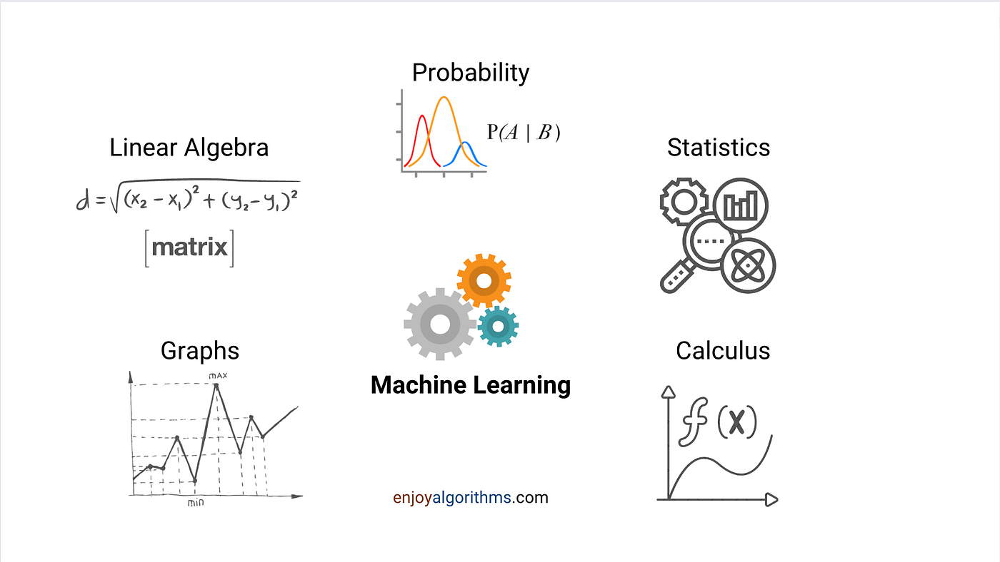

<!--  -->

  

---

# Introduction to Machine Learning for Engineers - Course Assignments

This repository contains my assignments completed for the course *18-461/18-661: Introduction to Machine Learning for Engineers* during Spring 2025 at Carnegie Mellon University. The repo showcases my work on mathematical problem sets and programming projects that apply machine learning techniques to real-world engineering problems.

## Repository Purpose

The assignments here reflect my efforts to implement and explore machine learning concepts taught in the course. They include both theoretical exercises and coding projects, targeting practical engineering applications, and align with the topics outlined in the syllabus below.

## Course Overview

*18-461/18-661: Introduction to Machine Learning for Engineers* introduces the fundamentals of machine learning with a focus on engineering applications. The course covers supervised and unsupervised learning techniques, theoretical foundations, and advanced topics, blending mathematical rigor with hands-on programming. Below is a summary of the key topics covered:

### Topics Covered
- **Supervised Learning Techniques**:
  - Linear and logistic regression
  - Support vector machines (SVM)
  - Naïve Bayes
  - Nearest neighbors
  - Decision trees, boosting, and random forests
  - Neural networks (including PyTorch implementation)
- **Unsupervised Learning Techniques**:
  - Clustering (e.g., k-means, expectation maximization)
  - Dimensionality reduction (e.g., PCA)
- **Fundamentals of Learning Theory**:
  - Optimization techniques (e.g., MLE/MAP)
  - Overfitting, bias/variance trade-off, and evaluation metrics
  - Risk minimization

The course emphasizes applying these techniques to solve engineering challenges, with a balance of theoretical understanding and practical implementation.

## Prerequisites

To succeed in this course and understand the assignments in this repository, the following prerequisites are required:
  - 21-325: Probability
  - 36-225: Introduction to Probability Theory
  - 36-218: Probability Theory for Computer Scientists
  - 36-217: Probability Theory and Random Processes (or equivalent).

A solid background in linear algebra, probability, and programming (preferably Python) is essential.

## Course Resources

- **Suggested Textbook**: *Machine Learning: A Probabilistic Perspective, 1st Edition* by Kevin Murphy (ISBN-13: 978-0262018029).
- **Supplemental Materials**: Lecture notes and additional readings are available on the course website (https://www.andrew.cmu.edu/course/18-661/).

## Assignment Context

The assignments in this repo consist of:
- **Mathematical Problem Sets**: Exercises to solidify understanding of concepts like regression, optimization, and learning theory.
- **Programming Projects**: Implementations of algorithms (e.g., SVM, neural networks, clustering) applied to engineering datasets, often using Python and libraries like PyTorch.

These assignments mirror the course’s focus on bridging theory and practice, offering insights into how machine learning can address real-world engineering problems.

Feel free to browse the code and solutions to see these concepts in action!
---