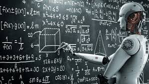

<!--  -->

  

---
# Math for AI

Welcome to the *Math for AI* repository! This repo serves as a centralized collection of my coursework, assignments, and projects related to mathematics-driven artificial intelligence and engineering applications. It focuses on courses that emphasize the mathematical foundations underpinning AI, machine learning, and stochastic systems, showcasing both theoretical explorations and practical implementations.

## Repository Purpose

The goal of this repository is to document my journey through courses that blend mathematics with AI and engineering. Each folder corresponds to a specific course and contains assignments, problem sets, and programming projects that highlight the application of mathematical concepts to real-world problems. This repo is designed to grow over time, incorporating additional courses that explore similar themes.

## Repository Structure

The repo is organized into folders, each representing a course. Currently, it includes:
- **`Applied_Stochastic_Processes`**: Assignments from *18751: Applied Stochastic Processes* (Fall 2024, CMU).
- **`Intro_ML_Engineers`**: Assignments from *18-461/18-661: Introduction to Machine Learning for Engineers* (Spring 2025, CMU).

Future folders will be added as I complete additional relevant courses. Each folder contains my work (e.g., code, write-ups, datasets) along with a brief description of its contents in this README.

## Current Courses

### 1. Applied Stochastic Processes (18751)
- **Folder**: `Applied_Stochastic_Processes`
- **Course Description**: This course provides a fundamental understanding of probability theory and its applications to stochastic systems, with a focus on engineering and signal processing contexts.
- **Topics Covered**:
  - **Probability and Random Variables**: Discrete and continuous random variables, multi-variate distributions.
  - **Statistical Inference**: Estimation theory, hypothesis testing.
  - **Stochastic Processes**: Markov chains, Gaussian processes, random walks, hidden Markov models, random fields.
  - **Signal Processing and Filtering**: Linear prediction, Wiener and Kalman filtering, spectrum estimation.
- **Assignments**: The folder contains problem sets and computational exercises that apply these concepts to solve complex, real-world problems (e.g., modeling randomness, filtering noisy signals).
- **Prerequisites**: Strong foundation in probability, linear algebra, and calculus.
- **Resources**: 
  - Textbook: *Probability and Stochastic Processes, 2nd Edition* by Roy D. Yates and David J. Goodman (ISBN-13: 978-1118324561).
  - Suggested readings listed in the course syllabus.

### 2. Introduction to Machine Learning for Engineers (18-461/18-661)
- **Folder**: `Intro_To_Machine_Learning`
- **Course Description**: This course introduces machine learning with an engineering focus, covering supervised and unsupervised learning techniques, theoretical foundations, and their applications.
- **Topics Covered**:
  - **Supervised Learning**: Linear/logistic regression, support vector machines, naïve Bayes, nearest neighbors, decision trees, neural networks (with PyTorch).
  - **Unsupervised Learning**: Clustering (e.g., k-means), dimensionality reduction (e.g., PCA).
  - **Learning Theory**: Optimization (MLE/MAP), overfitting, bias/variance trade-off, risk minimization.
  - **Advanced Topics**: Distributed learning, online learning (bandits), reinforcement learning, transformers (time permitting).
- **Assignments**: The folder includes mathematical problem sets and programming projects that implement ML algorithms for engineering datasets, blending theory with practice.
- **Resources**:
  - Suggested textbook: *Machine Learning: A Probabilistic Perspective, 1st Edition* by Kevin Murphy (ISBN-13: 978-0262018029).
  - Course website: https://www.andrew.cmu.edu/course/18-661/.

## Prerequisites for Understanding This Repo

To fully grasp the content here, a baseline knowledge of the following is recommended:
- **Mathematics**: Probability, statistics, linear algebra, and calculus.
- **Programming**: Python (familiarity with libraries like NumPy, PyTorch, or scikit-learn is a plus).
- **AI Concepts**: Basic understanding of machine learning or stochastic modeling is helpful but not required.

## How to Use This Repo

- **Explore by Course**: Dive into a specific folder to see assignments and solutions for that course.
- **Learn from Examples**: Use the code and write-ups as learning resources for mathematical AI topics.
- **Contribute Ideas**: If you have suggestions for organizing or expanding this repo, feel free to open an issue!

## Motivation

Mathematics is the backbone of artificial intelligence, providing the tools to model uncertainty, optimize systems, and extract insights from data. This repo reflects my effort to master these foundations and apply them to cutting-edge problems in engineering and AI.

Feel free to explore, and stay tuned for more as I continue my academic journey!

---